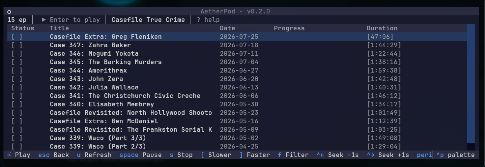
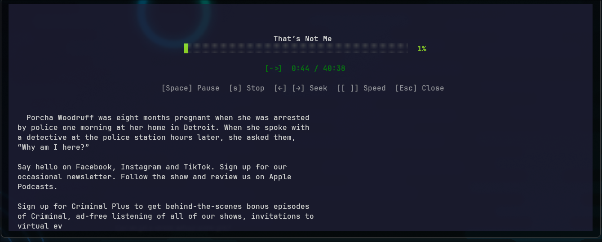
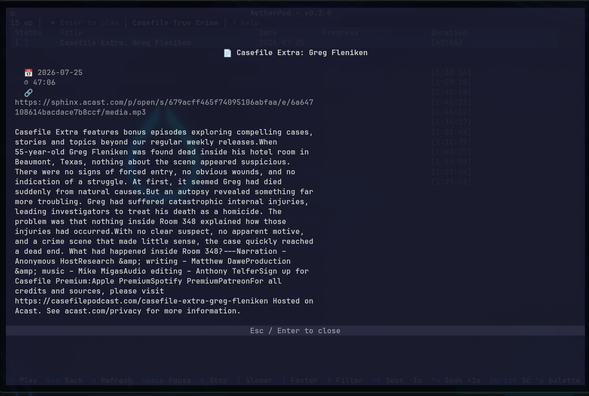

<pre align="center">
╔══════════════════════════════╗
║       A E T H E R P O D      ║
║   Terminal Podcast Manager   ║
╚══════════════════════════════╝
</pre>

<h1 align="center">AetherPod</h1>

<p align="center">
  <em>Terminal podcast manager for Arch Linux</em>
  <br>
  Subscribe, browse, and play podcasts — all from your terminal.
</p>

<p align="center">
  
  
  
</p>

---

## Screenshots






---

## Features

- **Subscribe** to any RSS/Atom podcast feed
- **Browse** episodes in a sortable DataTable with live progress bars
- **Play / pause / seek / speed** control via mpv IPC
- **Resume** playback where you left off
- **Cross-feed search**
- **Play queue** — auto-plays next episode on natural end
- **OPML import / export** — migrate from other podcast apps
- **Dark / light theme** toggle
- **Async feed refresh** — instant cache on startup, background updates
- **Splash screen** — branded startup with subscription stats
- **Audio EQ presets** — 3 voice-optimized EQ profiles (Bright / Warm / Balanced) with lookahead limiter — toggle instantly with `1`–`4` *(mpv only)*

---

## Quick Start

### Prerequisites

- Python 3.14+
- [mpv](https://mpv.io/) — audio player

```bash
# Install mpv (Arch)
sudo pacman -S mpv

# Install mpv (Debian/Ubuntu)
sudo apt install mpv

# Install mpv (macOS)
brew install mpv
```

### Install

Choose one:

```bash
# Option A — Interactive installer (recommended)
git clone https://github.com/systemd/AetherPod.git
cd AetherPod
bash scripts/install.sh

# Option B — Makefile (system-wide)
make install

# Option C — Makefile (user-local, no root)
make install-user

# Option D — Manual venv
python -m venv venv
source venv/bin/activate
pip install -r requirements.txt
pip install -e .
```

`scripts/install.sh` walks you through system-wide, user-local, or venv installation.

### Run

```bash
aetherpod           # Launch TUI
aetherpod --help    # CLI usage
aetherpod list     # List subscribed feeds
```

---

## Notes

- **Resume playback** — AetherPod saves your position and resumes when you press Enter on a partially-played episode. This works reliably for local files. For streaming URLs, resume depends on whether the podcast host's CDN supports HTTP range requests (`--start`). If the episode restarts from the beginning, the CDN is rejecting the seek — this is a host limitation, not a bug. Downloading the episode would allow reliable resume.

## Usage

| Key | Action |
|-----|--------|
| `a` | Add feed |
| `Enter` | Browse episodes / Play |
| `Space` | Pause / Resume |
| `s` | Stop |
| `[` / `]` | Speed down / up |
| `←` / `→` | Seek -30s / +30s |
| `1` / `2` / `3` / `4` | EQ presets: Off / Bright / Warm / Balanced *(mpv only)* |
| `f` | Toggle unplayed filter |
| `a` | Add to play queue |
| `v` | View play queue |
| `/` | Search across all feeds |
| `d` | Episode details |
| `N` | Now-playing screen |
| `t` | Toggle theme |
| `q` | Quit |
| `?` | Help |

---

## Data

| Data | Location |
|------|----------|
| State | `~/.local/state/aetherpod/state.json` |
| EQ presets (user-editable) | `~/.config/aetherpod/eq.json` |
| Logs | `~/.local/state/aetherpod/log/aetherpod.log` |

Override state path with `--data /custom/path.json` (supports relative paths for USB portability).

---

## License

[GPLv3](LICENSE) — Free as in freedom.
