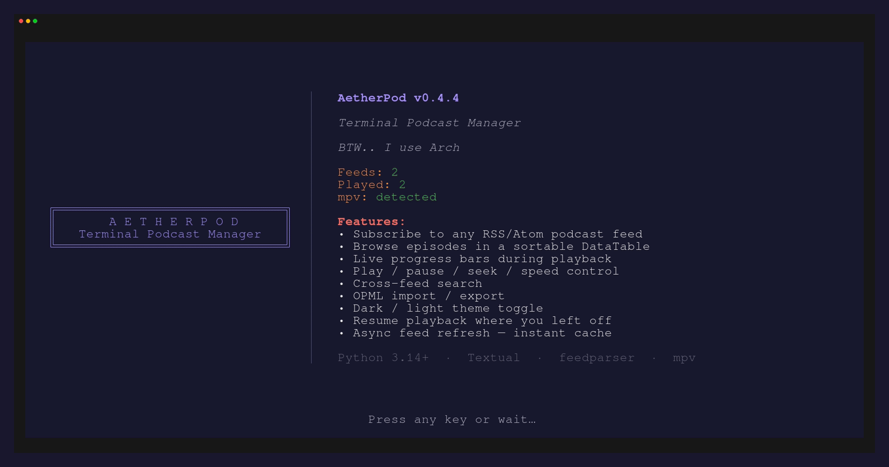

<pre align="center">
╔══════════════════════════════╗
║       A E T H E R P O D      ║
║   Terminal Podcast Manager   ║
╚══════════════════════════════╝
</pre>

<h1 align="center">AetherPod</h1>

<p align="center">
  <em>Terminal Podcast Manager</em>
  <br>
  Subscribe, browse, and play podcasts — all from your terminal.
  <br>
  <strong><em>BTW.. I use Arch</em></strong>
</p>

<p align="center">
  
  
  
  
  
  
  
  
</p>

---

## Screenshots




---

## Features

- **Subscribe** to any RSS/Atom podcast feed
- **Browse** episodes in a sortable DataTable with live progress bars
- **Zebra-striped lists** — alternating row colors on feeds and episode tables for easy scanning
- **Sort & filter feeds** — alphabetical order toggle (`s`) and inline name filter (`f`)
- **Play / pause / seek / speed** control via mpv IPC
- **Resume** playback where you left off
- **Cross-feed search**
- **Play queue** — auto-plays next episode on natural end
- **OPML import / export** — migrate from other podcast apps
- **Dark / light theme** toggle
- **Async feed refresh** — instant cache on startup, background updates
- **Splash screen** — branded startup with subscription stats
- **Audio EQ presets** — 3 voice-optimized EQ profiles (Bright / Warm / Balanced) with lookahead limiter — toggle instantly with `1`–`4`. **mpv only**: EQ requires mpv's lavfi audio filter bridge, so it works on Linux/macOS (mpv) but is unavailable on Windows (which uses VLC).
- **Automatic update check** — on startup, notifies you when a newer version is available (`aetherpod -u` to upgrade)

---

## Download a Pre-Built Executable

No Python or pip needed. Grab the binary for your platform from the
[Releases](https://github.com/AetherSolDev/AetherPod/releases) page
(or the latest [Actions build](https://github.com/AetherSolDev/AetherPod/actions) artifacts):

> Prefer a package manager? **`pip install aetherpod`** (PyPI) works on Linux, macOS, and Windows.

| Platform | Download |
|----------|----------|
| Windows (x86_64) | [aetherpod-windows.exe](https://github.com/AetherSolDev/AetherPod/releases/latest/download/aetherpod-windows.exe) |
| Linux (x86_64) | [aetherpod-linux](https://github.com/AetherSolDev/AetherPod/releases/latest/download/aetherpod-linux) |
| macOS (Apple Silicon) | [aetherpod-macos-arm64](https://github.com/AetherSolDev/AetherPod/releases/latest/download/aetherpod-macos-arm64) |
| macOS (Intel) | [aetherpod-macos-x86_64](https://github.com/AetherSolDev/AetherPod/releases/latest/download/aetherpod-macos-x86_64) |

> The binaries are unsigned, so Windows SmartScreen and macOS Gatekeeper may warn on first run.
> Windows: click **More info → Run anyway**. macOS: `xattr -d com.apple.quarantine aetherpod-macos`.

---

## Quick Start

### Prerequisites

- Python 3.9+
- [mpv](https://mpv.io/) (Linux/macOS) or [VLC](https://www.videolan.org/vlc/) (Windows, or any platform) — audio player

> **Windows:** VLC is detected automatically even when not on PATH (installed
> under `Program Files` or the registry). AetherPod uses VLC on Windows since
> mpv's control channel is Linux/macOS-only.
>
> **macOS:** VLC.app and Homebrew are detected even when not on PATH
> (`/Applications/VLC.app/Contents/MacOS/vlc`, `/opt/homebrew`, `/usr/local`).
> mpv is preferred when present.
>
> **EQ on Windows:** the audio EQ presets (`1`–`4`) require mpv and are
> therefore **not available on Windows** (VLC is used there). mpv-on-Windows
> support is on the roadmap.

```bash
# Install mpv (Arch)
sudo pacman -S mpv

# Install mpv (Debian/Ubuntu)
sudo apt install mpv

# Install mpv (macOS)
brew install mpv
```

### Install

AetherPod is on **PyPI** and published to GitHub Releases on every version tag.

**Option 1 — pip / pipx (recommended, all platforms):**
```bash
pipx install aetherpod        # isolated env + on PATH (best for a CLI/TUI)
# or
pip install --user aetherpod
```

**Option 2 — Interactive installer (from source):**
```bash
git clone https://github.com/AetherSolDev/AetherPod.git
cd AetherPod
bash scripts/install.sh
```

**Option 3 — Makefile:**
```bash
make install           # system-wide
make install-user      # user-local, no root
```

**Option 4 — Manual venv:**
```bash
python -m venv venv
source venv/bin/activate
pip install -r requirements.txt
pip install -e .
```

`scripts/install.sh` walks you through system-wide, user-local, or venv installation.

### Run

```bash
aetherpod           # Launch TUI
aetherpod --help    # CLI usage
aetherpod list     # List subscribed feeds
```

---

## Notes

- **Resume playback** — AetherPod saves your position and resumes when you press Enter on a partially-played episode. This works reliably for local files. For streaming URLs, resume depends on whether the podcast host's CDN supports HTTP range requests (`--start`). If the episode restarts from the beginning, the CDN is rejecting the seek — this is a host limitation, not a bug. Downloading the episode would allow reliable resume.

## Updating

AetherPod checks GitHub for a newer version on startup and shows a notification
when one is available.

```bash
aetherpod -u    # Upgrade to the latest version
```

- **pip / pipx installs** — upgrade via `pip install --upgrade aetherpod` (or `pipx upgrade aetherpod`). `aetherpod -u` also works for editable/git installs.
- **Executable installs** — download the new binary from the [Releases](https://github.com/AetherSolDev/AetherPod/releases) page (`-u` requires pip/git and will not work inside a bundled executable).

## Usage

| Key | Action |
|-----|--------|
| `a` | Add feed |
| `s` | Sort feeds (subscribe order → A-Z → Z-A) |
| `f` | Filter feeds by name |
| `Enter` | Browse episodes / Play |
| `Space` | Pause / Resume |
| `s` | Stop *(Episode screen)* |
| `[` / `]` | Speed down / up |
| `←` / `→` | Seek -30s / +30s |
| `1` / `2` / `3` / `4` | EQ presets: Off / Bright / Warm / Balanced *(mpv only)* |
| `f` | Toggle unplayed filter *(Episode screen)* |
| `a` | Add to play queue |
| `v` | View play queue |
| `/` | Search across all feeds |
| `d` | Episode details |
| `N` | Now-playing screen |
| `t` | Toggle theme |
| `q` | Quit |
| `?` | Help |

---

## Data

| Data | Location |
|------|----------|
| State | `~/.local/state/aetherpod/state.json` |
| EQ presets (user-editable) | `~/.config/aetherpod/eq.json` |
| Logs | `~/.local/state/aetherpod/log/aetherpod.log` |

Override state path with `--data /custom/path.json` (supports relative paths for USB portability).

---

## License

[GPLv3](LICENSE) — Free as in freedom.
